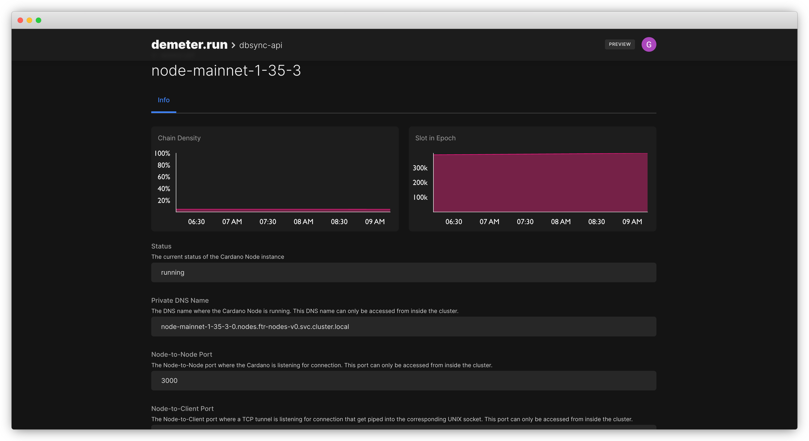
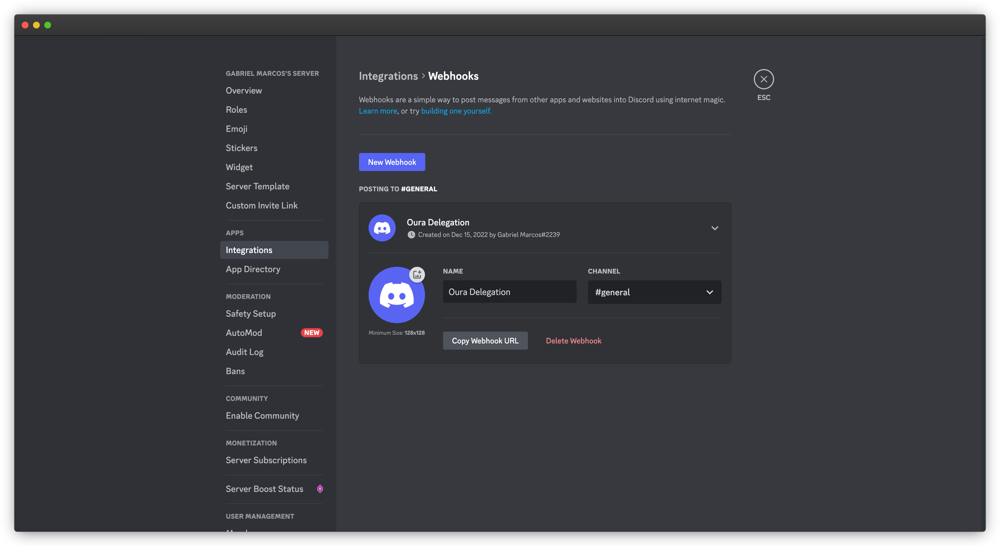

# Oura Webhooks Starter Kit

This starter kit shows how you can use a [Webhook Sink](https://txpipe.github.io/oura/sinks/webhook.html) available in [Oura](https://github.com/txpipe/oura) for publishing a message to a Discord server in real-time whenever a delegation is processed for a specific Pool hash. 

## Dev Environment

For running this starter kit you'll need access to a running instance of [Oura](https://github.com/txpipe/oura).

In case you don't want to install the required components yourself, you can use [Demeter.run](https://demeter.run) platform to create a cloud environment with access to common Cardano infrastructure. The following command will open this repo in a private, web-based VSCode IDE with access to a shared Cardano Node so we can install and run Oura in no time.

[](https://demeter.run/code?repository=https://github.com/txpipe/oura-webhooks-starter-kit&template=typescript)

## Implementation Details

> **Note**
> This guide assumes that you're using a Cardano Workspace as detailed above.

For implementing this solution we are going to start an [Oura](https://github.com/txpipe/oura) instance in [Demeter.run](https://demeter.run) with a filter configuration for processing in real time events of type [StakeDelegation](https://txpipe.github.io/oura/reference/data_dictionary.html#stakedelegation-event) and use a [Webhook Sink](https://txpipe.github.io/oura/sinks/webhook.html) for sending the message to a NodeJs/Express server in charge of pushing the message to a Discord server with the Discord Webhooks functionality. 


## Quick Start

Since you're running this starter kit from a _Cardano Workspace_, you already have access to the required infrastructure, such as the Cardano Node; it just a few commands to get Oura up and running against a node. 

### Install Oura binaries

From the _Cardano Workspace_ open a new terminal Window and use the following command for installing Oura

```bash
curl --silent --location https://git.io/JD2ix | \
    tar xz -C /tmp && mv /tmp/oura /usr/local/bin
```

### Add Oura configuration

The configuration file for Oura is very simple:

```toml
[source]
type = "N2N"
address = ["Tcp", "node-mainnet-1-35-3-0.nodes.ftr-nodes-v0.svc.cluster.local:3000"]
magic = "mainnet"

[[filters]]
type = "Selection"

[filters.check]
predicate = "variant_in"
argument = ["StakeDelegation"]

[sink]
type = "Webhook"
url = "http://localhost:8000/delegation"
```

For the `source.address` field we are going to connect with one of the nodes available in [Demeter.run](https://demeter.run). In this case we are connecting against a Node running in the `mainnet` but Nodes are available in other networks depending your use-case. 


You can select the Node of your preference and from the detail screen use the `Private DNS Name` and `Node-to-Node-Port` values for setting up the `address` field in the Oura config. 



The other value you need to set is the `sink.url`. This is the endpoint where the Webhook will be published whenever an event passes the filter.

Since we are going to run our NodeJs server inside of the Cardano Workspace we are going to use `localhost:8000` as the base URL. 

### Starting Oura

For starting Oura open a new Terminal Window and use the following command:

```bash
oura daemon --config oura-config.toml
```

That should be enough to have Oura running inside our Workspace.

### Building and Running the Application Server

The Application Server is a simple NodeJs/Express application listening on `PORT 8000` with only one `POST` endpoint at `/delegation`. 

This endpoint will receive the information from the Webhook whenever a `StakeDelegation` event is processed by Oura; will filter based on the `pool_hash` of the event, and will send a message to Discord with the data available. 

For sending the message to Discord you can check the [Discord developer portal](https://discordjs.guide/popular-topics/webhooks.html#what-is-a-webhook) for how to generate a Webhook. 



Once you have your Webhook generated you will get a link with the following structure:

```typescript
https://discord.com/api/webhooks/{WEBHOOK_ID}/{WEBHOOK_TOKEN}
```

Save this URL since we will be using the `WEBHOOK_ID` and `WEBHOOK_TOKEN` in our `.env` variable. 

For building the application open a new Terminal Window in the Development Workspace and use the following commands:
```bash
# install the dependencies
npm install
```

```bash
# build the application
npm run build
```

Now we are going to generate our `.env` file. from the terminal window type:

```bash
.env
```

Open the `.env` file in the terminal and fill in with the following variables
```bash
WEBHOOK_ID={the WEBHOOK_ID from your Discord URL}
WEBHOOK_TOKEN={the WEBHOOK_TOKEN from your Discord URL}
POOL_HASH={your pool hash so we can filter delegation events only for this pool}
```

Now we are ready to run the application. From the Terminal execute the following command:
```bash
node build/index.js
```
Your application should be now running and listening in `PORT 8000`

Whenever a new `StakeDelegation` event is generated you can process it in the `/delegation` route:

```typescript
app.post("/delegation", async (req, res) => {

  // filters delegation events for our pool hash
  if (req.body.stake_delegation.pool_hash !== process.env.POOL_HASH) {
    res.send({
      message: "event dismissed",
    });
    return;
  }

  // builds and sends the message to discord
  embed.setFields(
    { name: 'Block Hash', value: req.body.context.block_hash || 'unknown' },
    { name: 'Tx Number', value: req.body.context.tx_hash || 'unknown' },
  )
  
  await webhookClient.send({
    content: `pool hash: ${req.body.stake_delegation.pool_hash}`,
    embeds: [embed],
  });

  res.send({
    message: "event processed",
  });
});
```


In case you want to extend the functionality, this is the information available in the `StakeDelegation` event:

```bash
{
  context: {
    block_hash: 'f739edf316103e4a952e7cffe5e12d3146efc0b4f9e9f31421588d8ece7f1829',
    block_number: 8143083,
    slot: 79546609,
    timestamp: 1671112900,
    tx_idx: 8,
    tx_hash: '6a1be15ef80db3571e3eb6ea6301de3031fbe0b646d9302abf077f774458cbd3',
    input_idx: null,
    output_idx: null,
    output_address: null,
    certificate_idx: 1
  },
  stake_delegation: {
    credential: {
      AddrKeyhash: 'cb61e6a214e9e7c3836e80d1898a070db1d5f6e50b243bfdf30aa441'
    },
    pool_hash: '2c799c3eb2fb59dbf874500fa77df18a2acaa8cfec1793c928294a50'
  },
  fingerprint: null,
  variant: 'StakeDelegation',
  timestamp: 1671112900000
}
```


